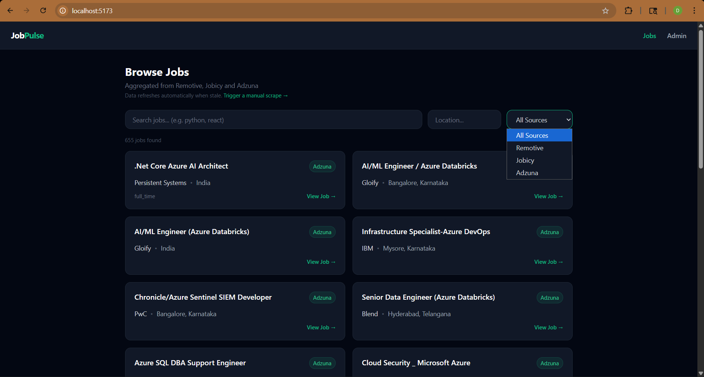
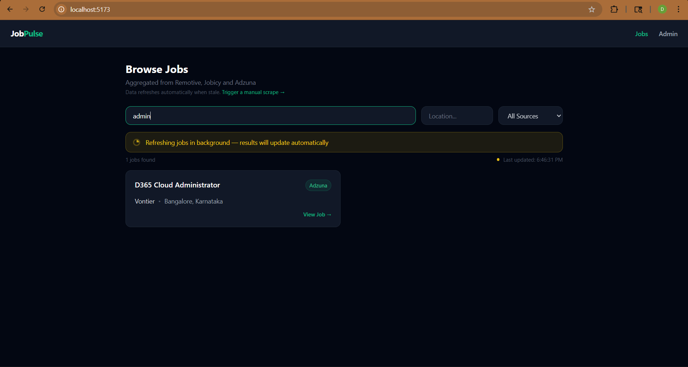
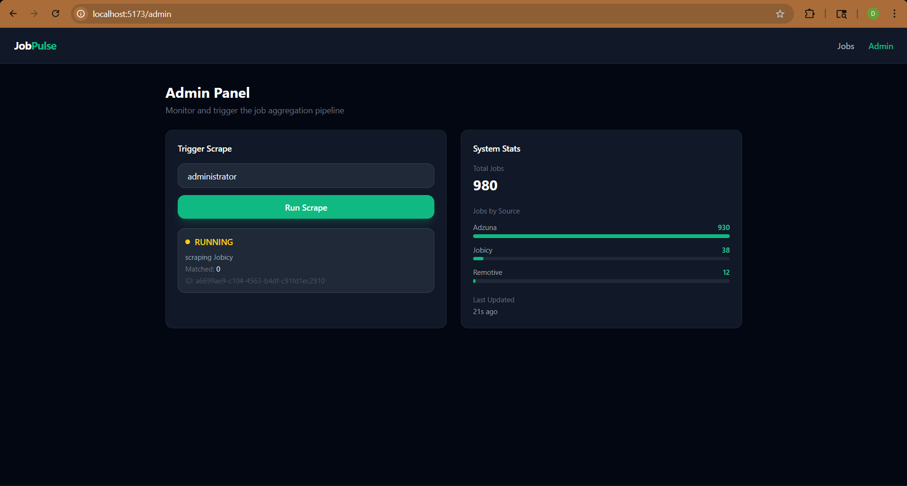
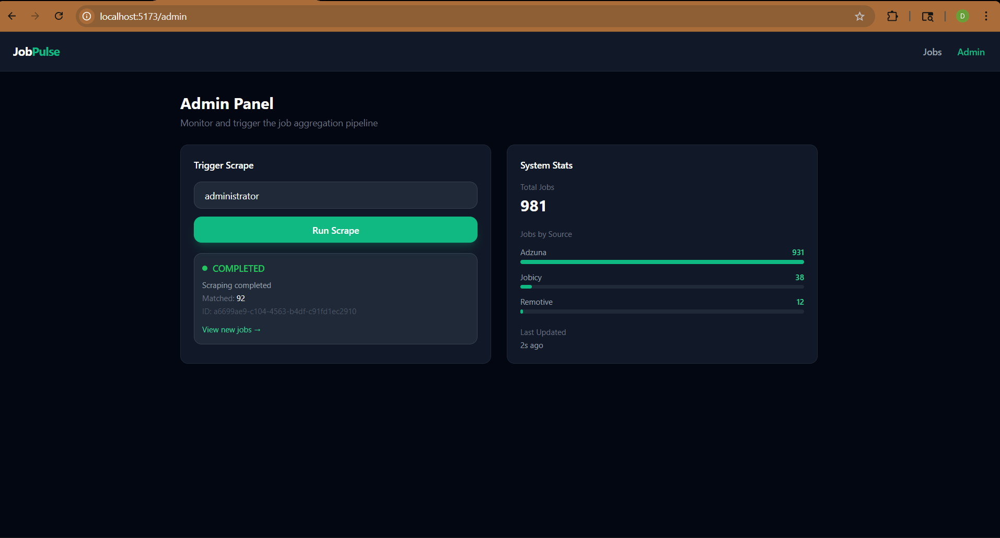

<div align="center">

# ⚡ JobPulse — Async Job Aggregation System

### A full-stack async job aggregation system with real-time UI and database-backed caching with asynchronous refresh

<br/>


<br/>


</div>

---

## 📌 Overview

**JobPulse** is a full-stack job aggregation system that fetches jobs from multiple API sources, caches results in a database, and auto-refreshes stale data asynchronously — all while serving a real-time React dashboard.

Built with a layered architecture: API → Executor → Scraper → Persistence. Each layer is independently testable and swappable.

> **"The database acts as a cache, serving results instantly while asynchronously refreshing stale data and cleaning up outdated records."**

> **Why this exists:** Job seekers waste time searching the same role across multiple platforms with inconsistent UX. JobPulse centralizes the data backend and serves it through a unified API and dashboard.

---

## 📸 Screenshots

### Jobs Page


### Jobs Page — Refreshing


### Admin Panel — Running


### Admin Panel — Completed


---

## ✨ Features

| Feature | Description |
|---|---|
| 🌐 **Multi-Source Aggregation** | Remotive, Jobicy, Adzuna APIs |
| ⚙️ **Background Execution** | Thread-based async executor — API never blocks on scrape |
| 🔄 **Cache-First Architecture** | DB serves as read cache, scrapes only when data is stale |
| 📊 **Job Status Tracking** | In-memory FSM with `pending → running → completed/failed` states |
| 🔎 **Filterable Query API** | Filter by keyword, location, source; paginated responses |
| 🔁 **Auto Refresh** | Stale data detection triggers background scrape automatically |
| 🧹 **Auto Cleanup** | Jobs older than 14 days removed automatically |
| 🔐 **API Key Auth** | Protected scrape endpoint via middleware |
| 📝 **Structured Logging** | JSON logs with request ID tracing |
| 🏗️ **Modular Architecture** | Add a new source by dropping in one scraper file |
| 🗄️ **Normalized Storage** | All sources → unified MySQL schema with deduplication |

---

## 🏛️ Architecture
```
Client (HTTP)
     │
     ▼
┌─────────────────────┐
│     API Layer       │  Flask Blueprints (api/jobs, api/scrape, api/stats, api/health)
└─────────┬───────────┘
          │
          ▼
┌─────────────────────┐
│  Execution Layer    │  services/executors/ (base.py + thread_executor.py)
│  + Status Store     │  services/status_store.py  ←  in-memory job registry (FSM)
└─────────┬───────────┘
          │
          ▼
┌─────────────────────┐
│   Scraper Layer     │  scrapers/ — one module per source
│  (Remotive,         │  Each: fetch API → filter → normalize → save
│   Jobicy, Adzuna)   │
└─────────┬───────────┘
          │
          ▼
┌─────────────────────┐
│  Persistence Layer  │  extensions/db.py + models/job.py
│  MySQL via Flask-   │  Normalized schema, UNIQUE job_url deduplication
│  SQLAlchemy         │
└─────────────────────┘

Parallel:
┌─────────────────────┐
│  Cleanup Service    │  services/cleanup_service.py
│  (daily thread)     │  Deletes jobs older than 14 days
└─────────────────────┘
```

---

## 🔄 End-to-End Flow

1. User triggers scrape from Admin UI
2. Frontend sends `POST /scrape` with keyword
3. Backend starts background thread immediately
4. API returns `scrape_id` — non-blocking
5. Frontend polls `/scrape/status/<id>` every 3 seconds
6. Scrapers fetch from Remotive, Jobicy, Adzuna
7. Jobs saved to DB (duplicates skipped via `UNIQUE job_url`)
8. Jobs page auto-updates via polling

This ensures:
- Non-blocking APIs
- Responsive UI
- Near real-time updates

---

## 🖥️ Frontend (React UI)

JobPulse includes a React-based admin dashboard that reflects real-time system state.

### Key UI Features

- 🔍 **Jobs Page** — Browse, search, filter and paginate aggregated jobs. Auto-refreshes via polling when new data is being fetched
- 🛠️ **Admin Panel** — Trigger scraping manually, monitor execution state (`PENDING → RUNNING → COMPLETED`), view system stats
- 🔁 **Live Feedback Loop** — Admin triggers scrape → backend processes in background → UI polls → jobs update automatically
- 📊 **Stats Panel** — Total jobs, jobs per source with visual bar indicators, last updated timestamp

---

## 📁 Project Structure
```
JobPulse/
│
├── app/
│   ├── api/                        # Flask Blueprints
│   │   ├── health/                 # GET /health
│   │   ├── jobs/                   # GET /jobs (cache + smart trigger)
│   │   ├── scrape/                 # POST /scrape, GET /scrape/status
│   │   └── stats/                  # GET /stats
│   │
│   ├── config/                     # Environment configs
│   │   ├── base.py
│   │   └── development.py
│   │
│   ├── extensions/
│   │   └── db.py                   # SQLAlchemy + MySQL setup
│   │
│   ├── models/
│   │   └── job.py                  # ORM model for job listings
│   │
│   ├── scrapers/                   # One module per source
│   │   ├── remotive.py             # Remotive API
│   │   ├── jobicy.py               # Jobicy API
│   │   ├── adzuna.py               # Adzuna API
│   │   └── __init__.py
│   │
│   ├── services/
│   │   ├── executors/
│   │   │   ├── base.py             # Abstract executor interface
│   │   │   └── thread_executor.py  # Thread-based executor
│   │   ├── scraper_runner.py       # Orchestrates scraper dispatch
│   │   ├── status_store.py         # In-memory job state registry (FSM)
│   │   └── cleanup_service.py      # Auto DB cleanup (daily)
│   │
│   ├── utils/
│   │   ├── db_retry.py             # Deadlock-safe DB writes with retry
│   │   └── freshness.py            # Stale data detection
│   │
│   ├── middleware.py               # Request ID, structured logging, API key auth
│   └── __init__.py                 # create_app()
│
├── frontend/
│   └── src/
│       ├── pages/
│       │   ├── Jobs.jsx            # Job search + auto polling
│       │   └── Admin.jsx           # Pipeline control + stats
│       ├── components/
│       │   ├── JobCard.jsx
│       │   ├── SearchBar.jsx
│       │   ├── StatusBanner.jsx    # Refreshing indicator
│       │   └── StatsPanel.jsx      # Stats with bar indicators
│       └── services/
│           └── api.js              # Centralized API calls
│
├── .env
├── requirements.txt
└── run.py
```

---

## 🚀 Quickstart

### Prerequisites

- Python 3.10+
- MySQL 8.0+
- Node.js 18+
- pip

### 1. Clone the repo
```bash
git clone https://github.com/Divya-41076/Async-Multi-Job-Scraper-Portal.git
cd Async-Multi-Job-Scraper-Portal
```

### 2. Set up a virtual environment
```bash
python -m venv venv
source venv/bin/activate        # Linux/macOS
venv\Scripts\activate           # Windows
```

### 3. Install dependencies
```bash
pip install -r requirements.txt
```

### 4. Configure environment

Edit `.env`:
```env
FLASK_ENV=development
SECRET_KEY=your-secret-key
API_KEY=your-api-key
DB_HOST=localhost
DB_PORT=3306
DB_NAME=job_scraper
DB_USER=root
DB_PASSWORD=yourpassword
ADZUNA_APP_ID=your-adzuna-app-id
ADZUNA_APP_KEY=your-adzuna-app-key
```

### 5. Set up the database
```bash
mysql -u root -p -e "CREATE DATABASE job_scraper;"
```

### 6. Run the backend
```bash
python run.py
```

Backend starts at `http://localhost:5000`

### 7. Frontend Setup
```bash
cd frontend
npm install
npm run dev
```

Frontend runs at `http://localhost:5173`

---

## 📡 API Reference

### `GET /health`

Check service status.
```json
{ "status": "ok", "service": "Job Aggregator API" }
```

---

### `POST /scrape`

Trigger a background scraping job.

**Headers:**
```
X-API-KEY: your-api-key
```

**Request:**
```json
{ "keyword": "python" }
```

**Response:**
```json
{
  "scrape_id": "7f9a2b11-...",
  "status": "PENDING",
  "message": "Scrape job created"
}
```

---

### `GET /scrape/status/{scrape_id}`

Poll the execution state of a scrape job.
```json
{
  "scrape_id": "7f9a2b11-...",
  "keyword": "python",
  "state": "COMPLETED",
  "message": "Scraping completed",
  "matched": 101,
  "started_at": "2026-03-19T11:20:00",
  "finished_at": "2026-03-19T11:21:39",
  "error": null
}
```

States: `PENDING → RUNNING → COMPLETED | FAILED`

---

### `GET /jobs`

Query aggregated job listings.

**Query params:**

| Param | Type | Description |
|---|---|---|
| `keyword` | string | Search in title and skills |
| `location` | string | Filter by location (partial match) |
| `source` | string | Filter by source |
| `sort` | string | `sort=latest` — order by newest |
| `page` | int | Page number (default: 1) |
| `limit` | int | Results per page (default: 20, max: 100) |

**Example:**
```
GET /jobs?keyword=python&location=bangalore&sort=latest&page=1&limit=20
```

**Response:**
```json
{
  "page": 1,
  "limit": 20,
  "total": 148,
  "scrape_triggered": false,
  "results": [
    {
      "id": 1,
      "title": "Backend Engineer",
      "company": "Razorpay",
      "skills": "python, flask, aws",
      "experience": "full_time",
      "salary": "$80k",
      "location": "Bangalore",
      "source": "Adzuna",
      "job_url": "https://...",
      "created_at": "2026-03-19T11:21:39"
    }
  ]
}
```

---

### `GET /stats`

Aggregated system statistics.
```json
{
  "total_jobs": 642,
  "jobs_per_source": {
    "Adzuna": 601,
    "Jobicy": 30,
    "Remotive": 11
  },
  "jobs_per_location": { "remote": 41 },
  "jobs_per_scrape": { "scrape-id": 101 },
  "latest_job_timestamp": "2026-03-19T11:21:39"
}
```

---

## 🗄️ Database Schema
```sql
CREATE TABLE jobs (
  id          INT AUTO_INCREMENT PRIMARY KEY,
  scrape_id   VARCHAR(36) NOT NULL,
  source      VARCHAR(50) NOT NULL,
  title       VARCHAR(150) NOT NULL,
  company     VARCHAR(120) NOT NULL,
  skills      TEXT,
  experience  VARCHAR(50),
  salary      VARCHAR(50),
  location    VARCHAR(120),
  job_url     VARCHAR(500) UNIQUE,
  created_at  DATETIME DEFAULT CURRENT_TIMESTAMP
);

CREATE INDEX idx_source ON jobs(source);
CREATE INDEX idx_location ON jobs(location);
CREATE INDEX idx_created_at ON jobs(created_at);
```

---

## ⚙️ How It Works

### Scraping
Each scraper in `app/scrapers/` follows the same interface:
```python
def scrape(keyword: str, scrape_id: str, save_job_fn):
    # fetch from API
    # normalize fields
    # call save_job_fn() for each job
    return metrics
```

Scrapers are dispatched by `scraper_runner.py` via `thread_executor.py` in a background thread. `status_store.py` tracks state in memory using a Finite State Machine.

### Cache + Auto Refresh
```python
# GET /jobs logic
jobs = get_jobs(filters)

if is_stale(keyword):
    if not status_store.is_scrape_running(keyword):
        trigger_background_scrape(keyword)

return jobs  # always returns immediately
```

### Deduplication
`job_url` has a `UNIQUE` constraint. Duplicate inserts are caught by `safe_db_write()` in `utils/db_retry.py` which handles `IntegrityError` and deadlocks with retry logic.

---

## 🚀 What Makes This Interesting

- Combines **background processing + polling UI** for near real-time updates
- Uses **database as a cache layer** instead of hitting APIs repeatedly
- Implements **in-memory FSM for job lifecycle tracking**
- Demonstrates **separation of concerns across layers**

---

## 🛠️ Tech Stack

| Layer | Technology |
|---|---|
| Language | Python 3.10+ |
| Web Framework | Flask |
| Database | MySQL + Flask-SQLAlchemy |
| Async Execution | Python Threading |
| Job Sources | Remotive API, Jobicy API, Adzuna API |
| Frontend | React + Vite + Tailwind CSS |
| HTTP Client | Axios |
| Config Management | python-dotenv |

---

## 🧩 Adding a New Source

1. Create `app/scrapers/newsource.py`
2. Implement the interface:
```python
   def scrape(keyword: str, scrape_id: str, save_job_fn):
       # fetch from API
       # normalize fields
       # call save_job_fn() for each job
       return metrics  # dict with total_fetched, matched, duplicates_skipped, success
```
3. Register in `app/scrapers/__init__.py`
4. Add to `scraper_runner.py`
5. That's it — executor and API pick it up automatically

---

## 🧠 Key Design Decisions

**Why DB as cache?**
Fetching APIs on every request is slow and hits rate limits. Storing results in DB allows instant reads while refreshing in background.

**Why thread-based executor?**
Simple, no external dependencies (no Celery/Redis needed). Sufficient for this scale.

**Why UNIQUE on job_url?**
Prevents duplicate jobs across multiple scrape runs. Deduplication at DB level is the most reliable approach.

**Why FSM for scrape state?**
Prevents invalid state transitions (e.g. COMPLETED → RUNNING). Makes the system predictable and debuggable.

---

<div align="center">
  <sub>Built with Python, Flask, React, and three job APIs. ☕</sub>
</div>
